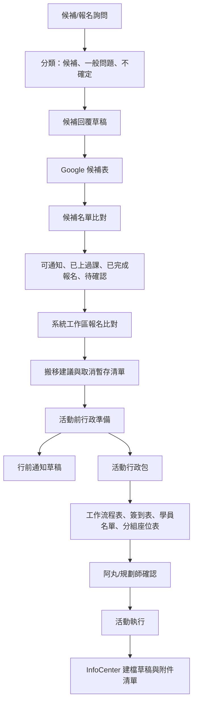

# 阿丸活動行政與候補比對需求摘要

## 一句話結論

阿丸需要的不是單一工具，而是一套能保留現有 MIS、Google 表單、Excel、Word 操作習慣，又能把「候補判斷、名單比對、通知草稿、活動行政文件產出、活動後紀錄」整理成可追蹤、可核准、可重複執行的工作流程。

這份摘要依據先前「分析阿丸需求」與四項表單自動生成 MVP 整理。公開版不放真實學員名單、手機、單位、報名資料或原始逐字稿。

## 核心工作流



## 主要資料來源

| 來源 | 可能內容 | 第一版處理方式 |
| --- | --- | --- |
| MIS 報名匯出 | 正式場次、報名者、系統工作區、報名狀態 | 轉成統一名單，保留來源列 |
| Google 候補表 | 候補者、希望場次、聯絡方式、通知狀態 | 比對可通知/排除/待確認 |
| Email / 聯絡訊息 | 候補詢問、一般問題 | 先分類與產生回覆草稿，不自動寄出 |
| Excel | 既有清理公式、分組或統計工作表 | 第一版沿用，不急著重寫 |
| Word 範本 | 工作流程表、簽到表、學員名單、分組座位表 | 由結構化資料產生 docx 草稿 |
| InfoCenter | 活動後事件、附件、照片、簽到表 | 產生建檔草稿與上傳清單 |

## 主要痛點

| 痛點 | 影響 |
| --- | --- |
| 候補與一般問題混在一起 | 每天要人工判斷哪些信件需要候補回覆 |
| 名單分散 | 候補表、正式場次、系統工作區、已上課紀錄分散，容易漏標記 |
| 系統工作區是暫存流程 | 被通知者先報名系統工作區後，仍要人工搬回正式場次並取消暫存報名 |
| 活動前文件多 | 工作流程、簽到、學員名單、分組座位、物資/便當都要手工整理 |
| 人力資訊來源分散 | 講師、規劃師、工讀生、志工常來自 Line 或人工確認 |
| 活動後建檔手動 | InfoCenter 事件欄位、附件與摘要仍要重新整理 |
| 個資風險高 | 學員姓名、手機、單位、報名狀態不能放到公開 repo 或公開頁 |

## Codex 可自動化的任務

| 階段 | Codex 任務 | 產出 |
| --- | --- | --- |
| P0 欄位盤點 | 盤點 MIS、Google 表、Excel、Word 範本欄位 | 欄位對照表與待確認問題 |
| P1 候補信件助理 | 分類候補/一般問題/不確定，產生回覆草稿 | 每日候補摘要與草稿 |
| P2 候補名單比對 | 比對姓名、Email、電話、場次、是否上過課 | 可通知、排除、已完成、待確認清單 |
| P3 系統工作區比對 | 找出誰應搬到哪個正式場次、是否取消暫存 | 搬移建議與人工操作清單 |
| P4 活動行政包 | 由課程資料與名單產出四份 Word 草稿 | 工作流程表、簽到表、學員名單、分組座位表 |
| P5 行前通知助理 | 依場次產生通知內容與收件名單 | 寄送前草稿與送達檢查提醒 |
| P6 InfoCenter 建檔包 | 活動後產生活動摘要、欄位內容、附件清單 | InfoCenter 草稿 |

## 既有 MVP

先前已建立一版 local-only 文件生成 MVP：

```text
course_data.example.json -> generate_amaru_forms.py -> 四份 .docx
```

已驗證方向：

- 四份 Word 都是固定版型加結構化資料填入。
- 學員名單與分組座位表可以共用同一份學員資料。
- 簽到表可由每日講師、工作人員、工讀生、志工名單生成。
- 工作流程表可由活動基本資訊、場地廠商資訊、人力統計、活動流程與物資清單生成。

尚待補強：

- DOCX render QA。
- 原版格式與頁面視覺比對。
- MIS/Google Sheet/Excel 欄位正規化。
- 真實個資留在 local/private，不進 public repo。

## 可能的解決方案

### 方案 A：草稿與報表助理

Codex 只產生候補摘要、回覆草稿、比對表與活動文件草稿，阿丸仍在 MIS、Google 表單、Excel、Word 中操作。

適合第一步，風險最低。

### 方案 B：本機活動行政包產生器

建立固定資料夾或小型本機工具，放入 MIS 匯出、Google Sheet 匯出、範本檔後，一鍵產生候補清單與活動行政包。

適合把四項表單 MVP 變成可反覆使用的工具。

### 方案 C：Gmail / Google Sheets / Drive 排程摘要

若取得授權，Codex 定期讀候補信件、Google 表單與 Drive 範本，產生每日摘要、場次提醒、文件草稿。

適合在欄位穩定與隱私流程確認後推進。

### 方案 D：MIS / InfoCenter 深度自動化

只有在流程回測穩定、具備測試環境與錯誤回復機制後，才考慮半自動搬移報名、取消系統工作區或寫入 InfoCenter。

這是後期，不是第一版。

## 自動化邊界

第一版可以做：

- 讀取匯出檔與範本。
- 產生清單、草稿、文件包、待確認項。
- 標出重複、缺欄、低信心、個資風險。

第一版不應直接做：

- 自動寄信。
- 自動修改 MIS 報名或取消報名。
- 自動修改 Google 表單/Sheet 狀態。
- 自動寫入 InfoCenter 或上傳活動附件。
- 在公開頁放真實學員個資、報名資料或原始逐字稿。
