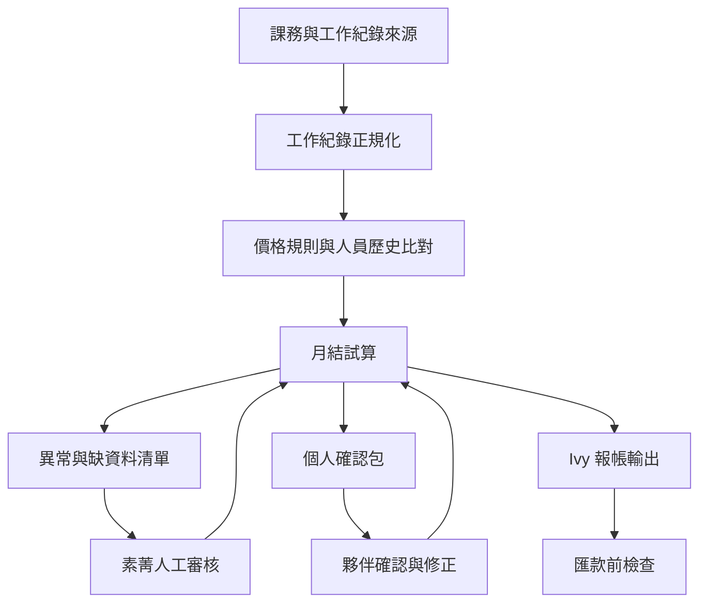

# 素菁帳務/月結需求摘要

## 一句話結論

素菁的需求不是「把一張表整理漂亮」，而是建立一個半自動的月結助理：把課務、諮詢、企劃、交通、補扣款與人員歷史累積整理成可追溯的月結試算、個人確認包、Ivy 報帳輸出與匯款前檢查。

這份摘要依據先前「分析素菁帳務需求」聊天與已做過的月結工作台雛形整理。因為內容涉及薪資、發票與付款風險，公開版只放流程與需求結論，不放完整敏感原文。

## 核心工作流

## 主要資料來源

| 來源 | 可能內容 | 第一版處理方式 |
| --- | --- | --- |
| Calendar / 課程紀錄 | 課程、訪視、講師、諮詢、內外部工作 | 匯入後轉成統一工作紀錄 |
| Google 表單 | 規劃師工時、企劃工時、報帳資料 | 檢查欄位、日期區間與人名一致性 |
| InfoCenter 匯出 | 薪資或案件相關匯出 | 當作來源之一，不直接視為最終正確 |
| 個人歷史表 | 累積趟數、級距、個人例外 | 用於判斷單價與升級狀態 |
| 專案/群組紀錄 | 企劃件數、稿件、小金句、粉專等 | 先建立待確認清單，避免自動判錯 |
| 補扣款資料 | 退款、補稅、差旅、設備扣款等 | 一律列入高風險人工審核 |

## 主要痛點

| 痛點 | 影響 |
| --- | --- |
| 資料來源太散 | 每月要跨 Calendar、表單、InfoCenter、個人表與訊息紀錄重建脈絡 |
| 計價規則複雜 | 同一人可能因角色、工作類型、內外部、歷史累積或專案而有不同規則 |
| 歷史累積不能斷 | 單價或級距可能依累積次數變動，不能只看本月資料 |
| 本人確認耗時 | 需要把明細整理給夥伴確認，錯誤回報後又要回頭修正 |
| Ivy 輸出要可對帳 | 月結結果要能轉成 Ivy 需要的分類表與後續合併資料 |
| 匯款/發票風險高 | 不適合第一版直接自動送出或正式開立，必須先做預覽與檢查 |

## Codex 可自動化的任務

| 階段 | Codex 任務 | 產出 |
| --- | --- | --- |
| P0 規則清冊 | 從既有表格與訪談整理人員、工作類型、計價規則、例外條件 | 規則草稿與缺資料清單 |
| P1 資料匯入 | 讀取 Calendar、Google 表單、InfoCenter 匯出與人工清單 | 統一格式的工作紀錄 |
| P2 缺漏檢查 | 檢查人名、日期、工作類型、數量、來源是否可對上 | 異常清單 |
| P3 月結試算 | 依規則與歷史狀態計算本月明細 | 試算表、個人小計、差異報告 |
| P4 個人確認包 | 產生每位夥伴可閱讀的月結摘要 | 可複製文字、PDF 或 Sheet 草稿 |
| P5 Ivy 輸出 | 把確認後資料轉成 Ivy 需要的分類格式 | Ivy 報帳輸出預覽 |
| P6 匯款前檢查 | 檢查重複人名、負數、分類加總、帳戶缺漏 | 匯款前風險清單 |

## 可能的解決方案

### 方案 A：月結資料檢查包

先不做完整系統，只讓 Codex 每月讀取匯出檔，產生缺漏清單、異常清單、個人對帳草稿與 Ivy 輸出預覽。

適合第一步，因為風險低、資料仍由素菁確認。

### 方案 B：素菁月結工作台

把先前雛形延伸成內部工作台，包含月結 Dashboard、類別工作價格、人員薪資檔案、待派薪草稿、Ivy 輸出預覽。

適合在規則清冊穩定後推進。

### 方案 C：課務到月結的共用資料管線

把佩欣、瑜君等課務端整理出的課程狀態，轉成素菁月結端可吃的標準欄位，減少月底重新整理。

適合在課務提醒工具與月結工作台都穩定後串接。

## 自動化邊界

第一版可以做：

- 匯入、整理、比對、試算。
- 產生個人確認包、Ivy 輸出預覽、匯款前檢查表。
- 標出缺規則、缺資料、疑似重複與金額異常。

第一版不應直接做：

- 自動匯款。
- 自動發送薪資或對帳訊息。
- 自動正式開發票。
- 自動改寫薪資主檔或付款資料。
- 在公開頁放真實個資、帳戶、完整薪資明細或原始逐字稿。
