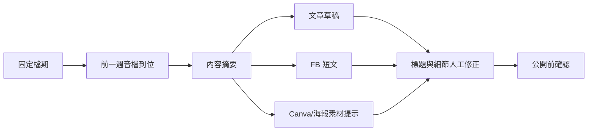

# 怡君工作流需求分析

## 來源與範圍

本頁依據 Kevin 提供的「怡君討論內容與錄音檔逐字稿」整理。公開頁只保留流程與需求摘要，不放入完整逐字稿、學員名單、問卷回覆或可識別個資。

## 第一性原則判斷

怡君的工作不是單純「做圖」或「寫文案」，而是把固定節目與分享會的內容資產一路轉成可發布、可寄送、可交接、可留存的行政成果。要降低負擔，第一版應先回答四個基本問題：

| 基本問題 | 對應需求 |
| --- | --- |
| 這次活動或節目的素材到了嗎？ | 報名表、海報、圖文、音檔、逐字稿、回饋問卷、文章位置 |
| 可以先產出哪些草稿？ | Podcast 摘要、部落格文章、FB 短文、Canva 圖像提示、Email 草稿 |
| 哪些動作還需要人確認？ | 標題、公開日期、寄送對象、文章來源、社群發布內容 |
| 月底要怎麼核銷？ | 起訖地、公里數、單位費率、交通費試算、單據狀態 |

## 可視化需求分析

### 線上分享會

### 每週 Podcast

### 交通核銷

## 需求摘要

| 面向 | 目前工作 | 痛點 | 自動化可能 |
| --- | --- | --- | --- |
| 線上分享會課前 | 報名表、海報、圖文與報名啟動 | 每月固定但仍需逐項確認 | checklist、素材缺漏提醒、文案草稿 |
| 線上分享會課後 | 語音轉文字、文章、寄送學員、社群重點再製 | 文章位置與交接對象要人工確認 | 逐字稿摘要、文章草稿、寄送草稿、交接追蹤 |
| Podcast 公開前 | 剪輯、海報、FB 短文、文章 | 檔名/標題不一定早知道，但內容音檔可先處理 | 音檔摘要、文章草稿、短文、圖像提示、待補標題欄 |
| 工具使用 | ChatGPT、Canva、GAA、Notebook LM | 工具分散，成果需要人工整合 | 將輸出整理成同一份發布工作台 |
| 交通核銷 | 查兩地公里數，依單位費率算交通費 | 每月底重複查詢，且單位規則不同 | 地址距離試算、費率表、異常清單與月結草稿 |

## Codex 自動化可能任務規劃

| 優先序 | 任務 | 輸入 | 輸出 | 人工確認點 |
| --- | --- | --- | --- | --- |
| P0 | 內容資產欄位盤點 | 分享會、Podcast、文章與社群流程 | 欄位字典與 checklist | 哪些欄位必填、哪些可晚補 |
| P1 | 分享會課後草稿包 | 逐字稿、活動資訊、回饋問卷名單 | 摘要、文章草稿、Email 草稿、社群重點 | 文章內容與寄送對象 |
| P1 | Podcast 公開前草稿包 | 音檔或逐字稿、固定檔期 | 摘要、文章草稿、FB 短文、海報提示 | 標題、公開日期、是否可發布 |
| P2 | 內容交接追蹤 | 文章位置、負責夥伴、發布渠道 | 若琪/社群素材交接清單 | 素材是否可公開、來源是否正確 |
| P2 | 交通核銷試算 | 起點、終點、單位、公里單價 | 公里數、交通費、異常清單 | 路線、費率與單據 |
| P3 | 月底核銷彙整 | 行事曆、工作紀錄、核銷試算 | 月結草稿、待補單據與高風險項目 | 正式核銷送出 |

## 可能的解決方案

| 方案 | 做法 | 優點 | 風險/限制 |
| --- | --- | --- | --- |
| 內容發布工作台 | 用 Sheet 或輕量頁面管理分享會、Podcast 的素材狀態、草稿與發布清單 | 快速落地，能先減少漏交接與重複寫文 | 需要先定義欄位與命名規則 |
| 音檔/逐字稿摘要器 | 音檔到位後先轉摘要，再產生文章、FB 短文與 Canva prompt | 能在標題未定時先處理內容 | 逐字稿品質不足時要人工校正 |
| 分享會課後套件 | 從逐字稿與回饋問卷產生寄送草稿、文章摘要與社群重點 | 每月固定流程最適合模板化 | 不可自動寄送，需確認收件對象 |
| 交通核銷小工具 | 輸入起訖地、單位與費率，產生公里數與金額試算 | 可直接減少月底查公里數時間 | 路線與費率涉及核銷規則，需人工審核 |
| Calendar 輔助核銷 | 從行事曆讀活動地點，月底產生交通費候選清單 | 減少漏報與重複輸入 | 行事曆地點若不完整，仍需補地址 |

## 第一版治理邊界

- 不自動發布部落格、粉專或 Podcast 內容。
- 不自動寄送逐字稿、文章或 Email 給學員。
- 不在公開頁保留完整逐字稿、問卷回覆、學員資料或可識別個資。
- 不自動認定交通費可以核銷；只提供公里數與金額試算。
- 音檔、逐字稿、文章與社群文案皆需怡君或負責夥伴人工確認後才可外送。

## 建議第一輪實驗

先選一集 Podcast 與一場線上分享會回測：

1. 建立素材 checklist。
2. 匯入音檔或逐字稿。
3. 產生摘要、文章草稿、FB 短文與 Canva 圖像提示。
4. 產生「待補標題、待確認公開日期、待交接若琪」清單。
5. 讓怡君人工修正後，記錄哪些欄位與提示最有用。
