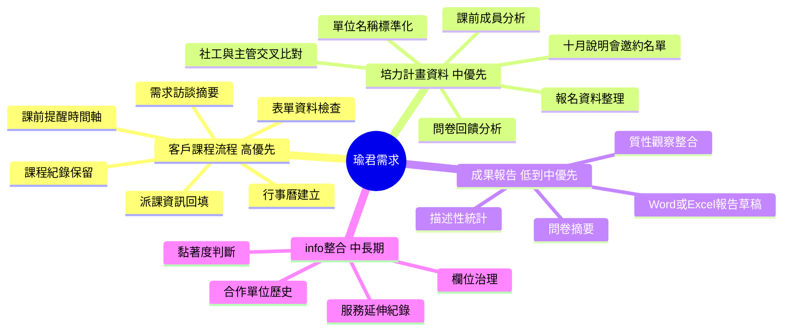
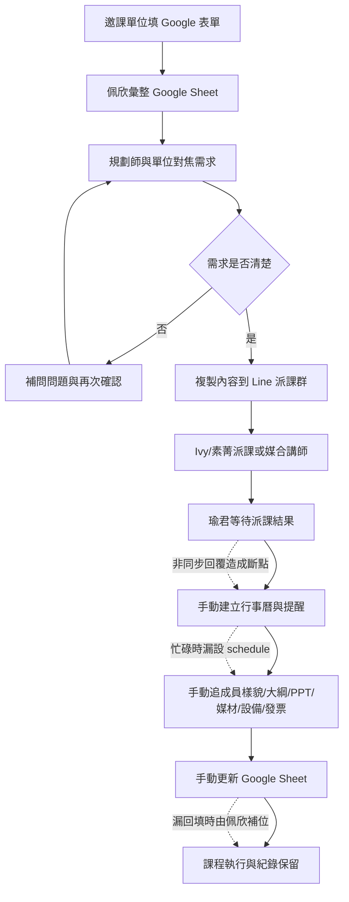
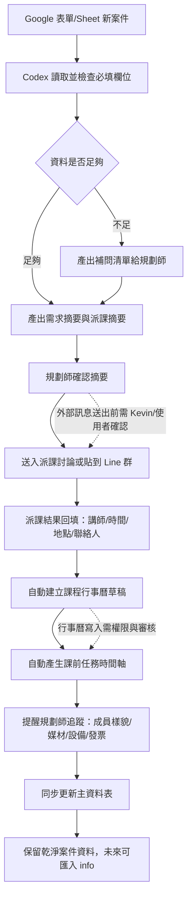

# 瑜君需求分析與 Codex 自動化規劃

來源：Kevin 與瑜君訪談逐字稿  
目的：將瑜君的工作痛點整理成可討論、可驗證、可分期開發的需求說明

## 1. 一句話結論

瑜君負責南區課務；她最需要的不是單一提醒工具，而是一套「南區課程案件推進助理」：從現有課程邀約 Google Sheet 讀取邀課資料，協助補齊需求摘要、派課後建立行事曆與課前任務時間軸，並把討論紀錄、課程資訊、後續分析資料留成可進 info 系統的乾淨資料。

目前最適合先做 MVP 的範圍是「客戶/課程邀約的課前提醒與資料整理」，培力計畫的跨表比對與成果報告可以放在第二階段。

## 1-1. 這次校正後的需求基礎

這份需求不是只靠逐字稿整理。比較準確的判讀方式是：

| 來源 | 角色 | 對需求的意義 |
| --- | --- | --- |
| 瑜君逐字稿 | 痛點與工作情境 | 說明她為什麼在意提醒、哪些節點容易漏、什麼情況會造成行政斷點 |
| 課程邀約 Google Sheet | 自動化資料來源 | 提供 Codex 可以讀取、檢查、篩選、產生提醒的欄位基礎 |
| 佩欣與思宜需求整理 | 共用模組參照 | 幫助判斷哪些功能可以共用，例如缺漏檢查、狀態對帳、提醒摘要、人工核准 |

已讀到的 Google Sheet 欄位顯示，現有資料表足以支撐第一版提醒 MVP。可用欄位包含：單位與聯絡資訊、課程主題與目的、期待日期地點、授課型態、人數、主要對象、學員樣貌、鐘點費與交通住宿、發票資訊、講師安排、助教安排、授課日期時段、素菁發票紀錄、佩欣建檔備註、指派規劃師。

因此第一版應該優先做「南區課務提醒與缺漏檢查」，而不是直接做完整派課系統。

## 2. 需求總覽



## 3. 核心痛點

| 類別 | 現況 | 痛點 | 影響 |
| --- | --- | --- | --- |
| 課前提醒 | 瑜君手動在行事曆設 schedule | 課程多、行政時段被壓縮時容易漏設 | 漏追成員樣貌、講師媒材、PPT、大綱、發票資訊 |
| 資料流轉 | Google 表單/Sheet、Line 派課群、行事曆、口頭/錄音摘要分散 | Ivy 回覆非同步，瑜君要再回頭補資料 | 同一案件要多次重建脈絡 |
| 表單資料品質 | 邀課單位填寫內容 rough 或不完整 | 需求不清、承辦也不確定自己要什麼 | 規劃師需花時間二次訪談與摘要 |
| 派課後回填 | 派課確認後需回填佩欣表格 | 瑜君容易漏，佩欣需補位 | 資料庫紀錄不完整 |
| 課程資訊保留 | 合作紀錄未來可能進 info | 欄位仍在討論，資料來源可能分散 | 未來匯入成本升高 |
| 培力資料分析 | 報名、出席、問卷來自不同資料 | 單位名稱不一致，主管/社工難 match | 難找出十月說明會優先邀約單位 |
| 成果報告 | 統計、問卷、質性觀察手動組裝 | 可由 AI 先產出描述性統計與草稿 | 目前可自動化但優先序低於客戶流程 |

## 4. As-Is 客戶課程流程



## 5. To-Be 客戶課程流程



## 6. 建議課前任務時間軸

| 時點 | 任務 | 對象 | 自動化產出 | 人工確認 |
| --- | --- | --- | --- | --- |
| 派課確認當天 | 建立課程主檔、行事曆草稿、任務清單 | 規劃師 | 課程摘要、欄位缺漏表、Calendar 草稿 | 課程時間、地點、講師 |
| 課前 3-4 週 | 確認成員樣貌與需求細節 | 邀課單位 | 補問清單、單位確認摘要 | 特殊需求與課程目標 |
| 課前 2 週 | 確認大綱、PPT、Ivy 對稿狀態 | 講師/Ivy | 講師待辦提醒、素材追蹤欄位 | 大綱/PPT版本 |
| 課前 1 週 | 確認當日流程、發票開立內容 | 邀課單位/素菁 | 課前確認信草稿、發票資訊提醒 | 金額、抬頭、統編、寄送方式 |
| 課前 3-5 天 | 確認媒材、設備、桌椅、特殊狀況 | 講師/單位 | 設備檢核表 | 場地限制、ADHD/身心議題等敏感資訊處理 |
| 課後 | 補齊紀錄、問卷/回饋、合作標籤 | 規劃師 | 課後紀錄草稿、info 匯入欄位 | 是否延伸諮詢或其他服務 |

## 6-1. 以現有 Sheet 可落地的提醒規則

| 提醒類型 | 判斷條件 | 需要讀取的欄位 | 輸出 |
| --- | --- | --- | --- |
| 瑜君/南區案件篩選 | `指派規劃師` 為瑜君，或地點屬南區 | 指派規劃師、預計舉辦課程的地點 | 本週南區案件清單 |
| 待確認日期 | 有期待日期，但 `授課日期時段` 未填 | 期待的授課日期與時段、授課日期時段 | 待確認日期提醒 |
| 待派講師 | 日期或需求已可判斷，但 `講師安排` 未填 | 講師安排、規劃師溝通聚焦、期待課程目的 | 派課摘要草稿 |
| 成員樣貌待補 | 學員樣貌空白、過短或不具體 | 主要參與對象、學員樣貌描述 | 補問清單 |
| 課前倒數提醒 | `授課日期時段` 已確認 | 授課日期時段、講師安排、助教安排、地點 | 3-4 週、2 週、1 週提醒 |
| 發票行政提醒 | 課前一週且發票資訊或紀錄不足 | 發票抬頭統編、發票特殊備註、素菁發票開立紀錄 | 發票確認提醒 |
| 交通住宿提醒 | 跨區或早課可能需要行政安排 | 交通費補助、停車/接送、住宿費 | 交通住宿檢核 |

現有 Sheet 還沒有明確欄位可以直接追蹤「課綱已確認、PPT 已確認、媒材已確認、課前流程已回覆單位、Calendar 已建立」。若要讓提醒更準，建議新增輕量狀態欄，而不是另開多張表。

## 7. Codex 自動化任務規劃

### Phase 0：資料盤點與欄位對齊

| 項目 | 內容 |
| --- | --- |
| 目標 | 確認目前 Google Sheet 欄位、必填欄位、派課欄位、未來 info 欄位的最小集合 |
| Codex 可做 | 讀取 Sheet 結構、列出欄位、標示缺漏與重複、產出欄位對照表 |
| 需要權限 | Google Sheet 檢視權限；如要寫回則需編輯權限 |
| 驗證 | 用 5-10 筆歷史案件測試是否能產出完整摘要 |
| 產出 | `課程案件欄位字典`、`缺漏檢查規則`、`MVP資料表設計` |

### Phase 1：客戶課程 MVP

| 項目 | 內容 |
| --- | --- |
| 目標 | 新案件或已派課案件可自動產生摘要、待補問題、課前任務時間軸 |
| Codex 可做 | 讀取案件資料、生成需求摘要、生成 Line/Email 可貼上的確認稿、建立任務清單 |
| 人工介入 | 規劃師確認摘要後才貼給單位或派課群 |
| 驗證 | 以 2 個真實課程回測：是否抓到成員樣貌、媒材、PPT、發票、設備等提醒 |
| 產出 | `課程案件摘要`、`補問清單`、`課前提醒清單` |

### Phase 2：行事曆與提醒整合

| 項目 | 內容 |
| --- | --- |
| 目標 | 派課完成後自動建立課程 Calendar 事件與多個提醒節點 |
| Codex 可做 | 依課程日期倒推提醒日期、建立 Google Calendar 草稿或待確認事件 |
| 人工介入 | 第一次啟用需確認 calendar 寫入規則與通知對象 |
| 驗證 | 測試一筆課程是否能產生正確時間點與正確事件內容 |
| 產出 | `課程事件`、`3-4週/2週/1週/課前提醒事件` |

### Phase 3：寫回 Google Sheet 與 info 前置資料庫

| 項目 | 內容 |
| --- | --- |
| 目標 | 派課結果、課前確認狀態、課後紀錄能回寫到同一份主表 |
| Codex 可做 | 更新欄位、生成狀態標籤、建立可匯入 info 的乾淨資料 |
| 風險 | info 欄位仍在討論，需避免先做死欄位 |
| 驗證 | 與素菁/阿丸欄位設計比對，不新增衝突欄位 |
| 產出 | `主資料表`、`info匯入候選欄位`、`合作紀錄摘要` |

### Phase 4：培力計畫資料比對與報告輔助

| 項目 | 內容 |
| --- | --- |
| 目標 | 比對社工/主管報名與回饋，找出十月說明會優先邀約單位 |
| Codex 可做 | 單位名稱標準化、跨表比對、回饋摘要、描述性統計草稿 |
| 前置條件 | 報名表欄位需更固定：縣市、單位正式名稱、角色、職稱、是否願意揭露 |
| 驗證 | 人工抽查 20 筆單位 match 結果 |
| 產出 | `單位別參與矩陣`、`主管/社工回饋交叉分析`、`邀約優先名單` |

## 8. 自動化任務清單

| 任務 | 觸發 | Codex 動作 | 輸出 | 優先序 |
| --- | --- | --- | --- | --- |
| 新案件缺漏檢查 | Sheet 新增/手動指定案件 | 檢查必填欄位與語意缺口 | 缺漏清單、補問句 | 高 |
| 需求訪談摘要 | 貼上逐字稿或錄音轉文字 | 摘要課程目標、對象、困難、建議方向 | 給單位確認的 summary | 高 |
| 派課摘要 | 需求摘要完成 | 轉成 Ivy/素菁可判斷講師的派課資訊 | Line 群可貼稿 | 高 |
| 派課後課程主檔 | 講師/時間/地點確認 | 產生課程主檔與行事曆內容 | Calendar 事件草稿 | 高 |
| 課前提醒產生器 | 課程日期確定 | 倒推 3-4週、2週、1週、3-5天任務 | 提醒事件或任務表 | 高 |
| Sheet 回填提醒 | 案件狀態改變 | 提醒或協助回填派課/課前確認結果 | 更新建議或直接寫回 | 中高 |
| 合作紀錄摘要 | 課後 | 摘要課程結果、延伸服務可能 | info 匯入文字 | 中 |
| 培力單位名稱標準化 | 匯入報名/問卷資料 | 建立 alias map、標準化單位名 | 清理後資料表 | 中 |
| 培力交叉分析 | 社工與主管資料齊備 | 比對單位參與與問卷回饋 | 優先邀約名單 | 中 |
| 成果報告草稿 | 統計與質性材料齊備 | 產生描述性統計與段落草稿 | Word/Excel 草稿 | 中低 |

## 9. 可能解決方案

### 方案 A：Google Sheet + Codex 半自動助理

適合第一版。

- 使用現有 Google 表單/Sheet 作為資料來源。
- Codex 讀取指定案件，產出摘要、補問清單、派課摘要、提醒時間軸。
- 外部訊息由瑜君人工貼出，避免一開始就自動發送。
- 優點：最快驗證、對現有流程干擾最小。
- 限制：仍需人工觸發與人工貼訊息；提醒寫入需要第二階段才完整。

### 方案 B：Google Sheet + Calendar + 任務狀態欄

適合第二版。

- 在 Sheet 加上狀態欄位：需求待補、待派課、已派課、待課前確認、待發票、已完成。
- 派課確認後自動建立 Calendar 事件與倒推提醒。
- 課前任務完成後回寫狀態。
- 優點：能直接降低漏追與漏回填。
- 限制：需要 Google Calendar/Sheet 寫入權限與清楚的欄位規則。

### 方案 C：課程案件小後台

適合流程穩定後。

- 做一個簡單後台：案件列表、狀態看板、課程詳細頁、提醒時間軸、摘要產生器。
- Google Sheet 可以先當資料庫，之後再換正式資料庫或 info。
- 優點：比 Sheet 更適合多人協作與狀態追蹤。
- 限制：需要維護介面、權限與資料同步。

### 方案 D：info 整合前置資料層

適合中長期。

- 先將課程、單位、講師、合作紀錄整理成乾淨資料模型。
- 等素菁/阿丸確定 info 欄位後，再做匯入或同步。
- 優點：避免五六份表單分散後再痛苦合併。
- 限制：需等待 info 欄位與權限確認。

## 10. 建議 MVP 範圍

第一版不要先做完整派課系統，先做「南區課程案件提醒助理」：

1. 讀取或貼上一筆課程案件資料。
2. 產出三種文字：
   - 給邀課單位的需求確認摘要。
   - 給 Ivy/素菁的派課摘要。
   - 給瑜君自己的課前任務時間軸。
3. 標示資料缺漏：
   - 成員樣貌。
   - 課程目標。
   - 日期/時間/地點/地址。
   - 聯絡人與電話。
   - 講師媒材/設備需求。
   - 發票資訊。
4. 允許瑜君人工微調。
5. 先不自動發送 Line、Email，也先不直接寫入正式 info。

## 10-1. 和佩欣、思宜需求的合併策略

可以把大家的需求統整到一個 repo，而且長期來看會比較好維護。建議不要把「佩欣 repo、思宜 repo、瑜君 repo」硬合成一頁，而是做成一個總覽型 repo：

```text
course-ops-automation-requirements/
  README.md
  people/
    peixin/
      needs-analysis.md
      workflow-map.md
    siyi/
      needs-analysis.md
      workflow-map.md
    yujun/
      needs-analysis.md
      workflow-map.md
  shared-modules/
    reminder-engine.md
    sheet-field-dictionary.md
    status-check-rules.md
    message-draft-templates.md
  public-site/
    index.html
    peixin.html
    siyi.html
    yujun.html
```

合併後的好處：

| 好處 | 說明 |
| --- | --- |
| 共用需求不會重複寫 | 三人的缺漏檢查、提醒、狀態對帳、摘要草稿可以共用 |
| 個別工作流仍保留差異 | 佩欣、思宜、瑜君可以各自有頁面，不會被總表吃掉細節 |
| 比較容易規劃開發順序 | 可先做共用模組，再接個別角色流程 |
| 公開網址更好分享 | 一個首頁導向三個需求頁與共用自動化模組 |

不建議一開始就刪掉原本佩欣與思宜 repo。比較安全的做法是：

1. 先建立新的總覽 repo。
2. 把佩欣、思宜、瑜君的需求整理複製或匯入到 `people/`。
3. 保留原 repo 作為歷史版本與舊連結。
4. 在原 repo README 加上「已整合到總覽 repo」的連結。
5. 等總覽 repo 穩定後，再決定是否封存原 repo。

如果未來要做真正的產品或內部工具，單一 repo 也可以升級成 monorepo，把需求文件、資料表欄位字典、提醒規則、前端頁面與自動化腳本放在一起。

## 11. 待確認問題

| 問題 | 為什麼重要 |
| --- | --- |
| `指派規劃師` 是否可靠標記瑜君案件？ | 若不可靠，就要用地點推估南區案件 |
| 哪些欄位是派課前必填？哪些可派課後補？ | 避免過度卡流程 |
| 派課結果要由誰輸入？瑜君、Ivy、素菁或佩欣？ | 決定寫回權限與責任分工 |
| Calendar 事件要建立在哪個日曆？邀請誰？ | 涉及權限與通知噪音 |
| 課前提醒要放 Calendar、Sheet、Slack/Line，還是每日摘要？ | 決定提醒介面 |
| 給單位的 summary 是否可由 AI 草稿後人工送出？ | 外部溝通需審核 |
| 敏感資訊如孩子身心議題要如何記錄？ | 需最小化揭露與權限控管 |
| info 欄位目前討論到哪個版本？ | 避免和素菁/阿丸重工 |
| 培力報名表是否能改成固定單位欄位？ | 影響後續跨表分析可行性 |

## 12. 風險與治理

| 風險 | 建議處理 |
| --- | --- |
| 自動發送錯誤訊息給單位 | MVP 階段只產生草稿，不自動外送 |
| Calendar 提醒過多造成噪音 | 先用單筆課程測試，再定義 no-op 規則 |
| Sheet 欄位還沒穩定就做死 | 用欄位字典與對照表，不直接綁死 info |
| 個資或敏感需求外流 | 摘要中避免寫入不必要敏感細節，設定權限 |
| 單位名稱無法自動 match | 建立 alias 字典，低信心比對交給人工確認 |
| 和公司現有沙盒/報表工具重工 | 成果報告放後期，先聚焦客戶流程 |

## 13. 建議下一步

1. 向素菁確認是否可取得客戶 Google Sheet 檢視權限。
2. 匯出或讀取 5-10 筆代表性課程案件。
3. 定義「派課前必填欄位」與「課前提醒預設時間軸」。
4. 用 Codex 產生第一版：
   - 案件摘要。
   - 缺漏問題。
   - 派課摘要。
   - 課前任務時間軸。
5. 請瑜君用兩筆真實案件回饋：哪些有幫助、哪些太吵、哪些需要人工判斷。

## 14. Expansion Review Card

| 項目 | 判斷 |
| --- | --- |
| What changed | 目前只是提出 local automation/workflow proposal，尚未建立長期自動化 |
| Why needed | 瑜君的課程行政流程有高重複、高漏失風險、跨工具資料斷點 |
| Owner agent | workflow_designer + automation_auditor |
| Trigger | 新課程案件、派課確認、課前倒數節點、培力資料分析 |
| Should not do | 不在未審核時自動發送外部訊息；不直接寫入 info；不處理不必要敏感資料 |
| Proof | 以歷史案件回測摘要與提醒清單是否正確 |
| Approval required | Google 權限、Calendar 寫入、外部訊息、自動化排程、info 匯入 |
| Source of truth | 初期為客戶 Google Sheet；中期為主資料表/欄位字典；長期依 info 欄位 |
| Local/global | 先保持 local workflow proposal，跑過多次有效後再考慮自動化 |
| No-op rule | 案件資料不足、日期未確認、派課未完成時，只產生補問清單，不建立提醒 |
